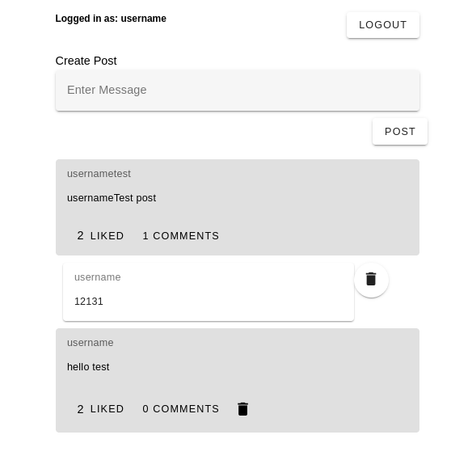
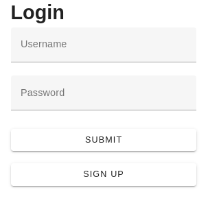
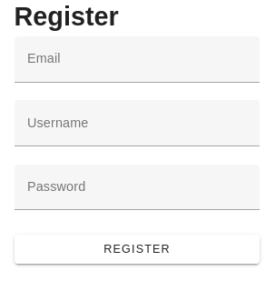

# Nuxt 3 Simple Social Media App Test

A Simple Social Media App made using Nuxt 3, Vuetify, MongoDB, mongoose and Sidebase/Nuxt-Auth.

This app includes sign-up, sign-in with password hashing using bcrypt.

App's Features include:
post creation, post like, comment, delete comment and delete post.

MongoDB is served using Docker. Use the docker-compose file to start the mongoDB instance or use your own mongoDB server by setting the MONGO_URI inside '.env' file.

Bruno is used for API Testing, use the 'API Tests' folder to test all the apis available in this app. Use Bruno for testing or import the [Api Testing Collection](<Api Tests/Api Testing Collection.json>) into your POSTMAN application.
Set "AUTH_BYPASS" to "true" inside ".env" to test the authenticated apis.

## Screenshots

